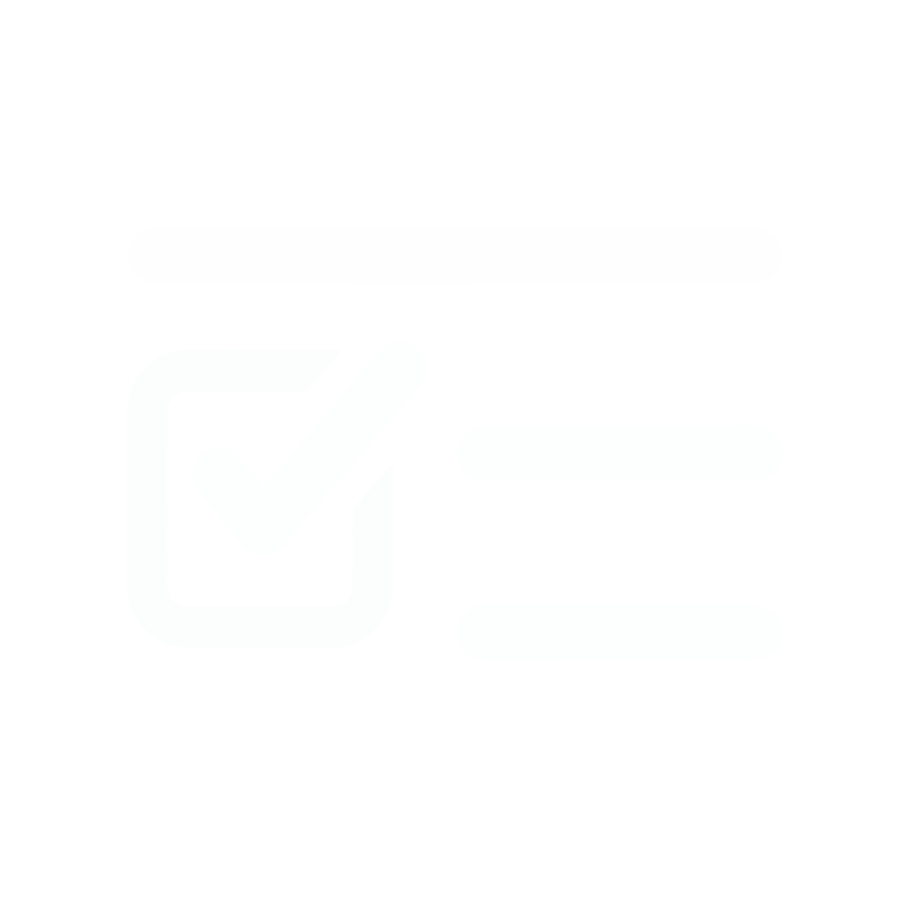
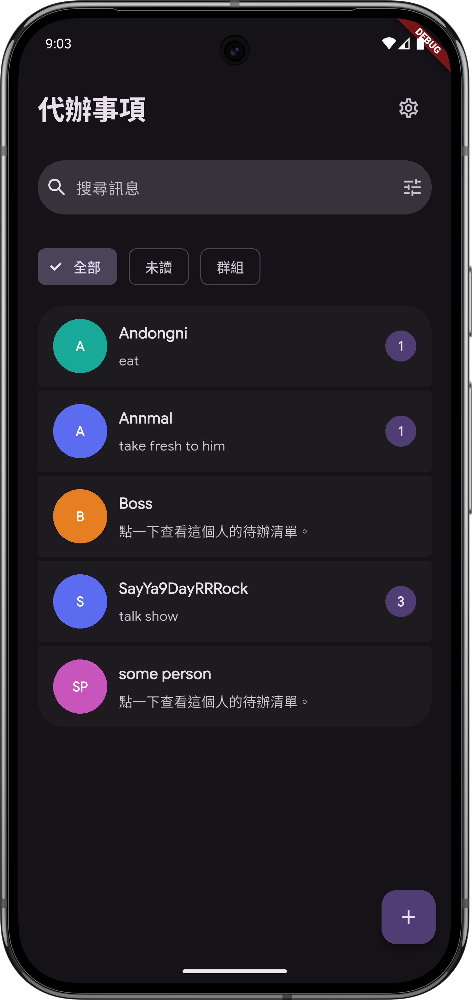
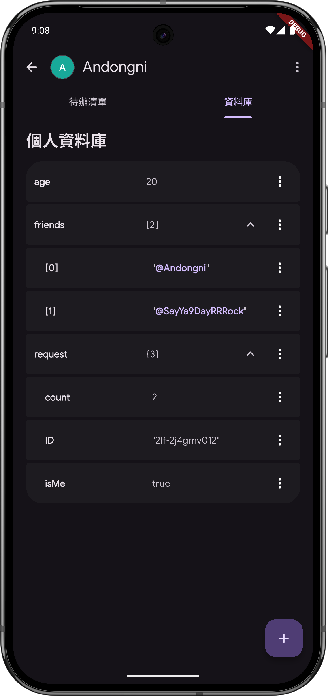
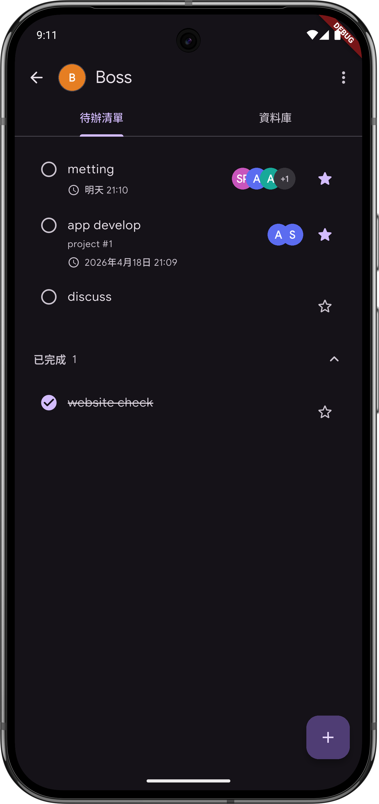

  
  <h1>Trace</h1>

  <a href="https://deepwiki.com/andongni0723/people_todolist_app">
    

  
  

  A people-centered Flutter to-do app that organizes tasks around relationships, with per-person context, notes, and a personal database.

  
  
  

> Vibe-Coding 98%

## Features
- Conversation-style home screen that helps you scan people and their latest to-do context quickly.
- Dedicated per-person to-do pages with profile notes, progress, and actionable task items.
- Personal database editor for storing private or public JSON-based context for each person.
- Local-first data storage with backup export and import support.
- Material 3 interface designed for daily task tracking around real people.

## Tech Stack
- **Dart**: Built with modern Dart and Flutter tooling.
- **Flutter**: Used to build the full Android app UI.
- **Material Design 3**: Provides the design system and UI language.
- **flutter_riverpod**: Handles app state and UI data flow.
- **Drift**: Persists people, to-dos, participants, and personal database records locally.
- **GoRouter**: Handles in-app navigation and routing.
- **easy_localization**: Provides localized app strings.
- **SharedPreferences / FilePicker / Share Plus**: Support settings persistence and data backup flows.

## Usage

Get the latest package in [Release](https://github.com/andongni0723/people_todolist_app/releases/latest/)
